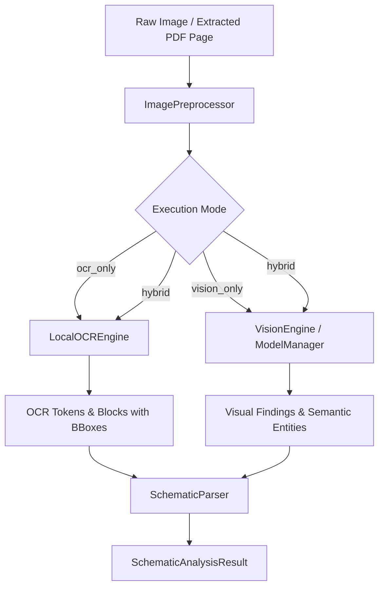

# Phase 5 — OCR & Vision Subsystem Architecture

> **Component:** Sovereign OCR & Vision Engine  
> **Subsystem Path:** `backend/app/services/vision/`  
> **Authoritative Baseline:** `docs/implementation_plan.md`  

---

## 1. Overview & Architectural Goals

The Sovereign OCR & Vision Engine provides local, air-gapped optical character recognition and multimodal vision-language model (VLM) inference for refinery inspection reports, non-destructive testing (NDT) documentation, and engineering piping & instrumentation diagrams (P&IDs).

### Core Design Tenets:
1. **Zero External Sockets:** All inference is executed locally (Tesseract C++ library / Ollama local daemon). No telemetry, no external API keys, and no model downloads over the public Internet.
2. **Hardware & VRAM Governance:** Operates within an 8 GB VRAM envelope on RTX 4060 hardware. In conjunction with Phase 2's `ModelManager`, heavy VLM models (`qwen2.5-vl:3b`) are loaded serially and swapped safely to prevent CUDA out-of-memory (OOM) faults.
3. **Drawing Detection vs. Drawing Recognition Separation:**
   - **Phase 4 Ingestion:** Employs a fast geometric aspect-ratio/vector-density heuristic (`is_drawing_likely`) without loading heavy models.
   - **Phase 5 Vision Engine:** Performs semantic understanding (candidate tag identification, instrument bubbles, line specifications, and equipment labels).
4. **Spatial Provenance:** Every detected token, text block, and visual entity retains absolute and normalized bounding box coordinates `[x0, y0, x1, y1]`, confidence scores `[0.0, 1.0]`, and page/file provenance.
5. **Multi-Mode Flexibility:**
   - `ocr_only`: High-speed CPU execution extracting text and candidate tag patterns.
   - `vision_only`: Pure VLM inference describing diagram semantics.
   - `hybrid`: Combined pass aggregating OCR coordinates with VLM visual reasoning.

---

## 2. Component Structure

```
backend/app/services/vision/
├── __init__.py               # Public module exports
├── base.py                   # Data models (BoundingBox, OCRToken, OCRBlock, VisualFinding, etc.)
├── preprocessor.py           # Pillow-based deterministic image preprocessor
├── ocr_engine.py             # LocalOCREngine with TesseractOCRProvider & MockOCRProvider
├── vlm_client.py             # VisionEngine with ModelManagerVisionProvider & MockVisionProvider
└── schematic_parser.py       # SchematicParser orchestrating P&ID analysis workflows
```

---

## 3. Data Flow & Provenance Model



### Spatial Coordinate System
- Bounding boxes conform to `BoundingBox`:
  - `x0, y0`: Upper-left corner.
  - `x1, y1`: Lower-right corner.
  - `normalized`: Boolean indicating whether coordinates are normalized to `[0.0, 1.0]` relative to image width and height.

---

## 4. API Endpoints

1. **`POST /api/v1/vision/ocr`**:
   - Accepts multipart file upload or `file_sha256` reference from Phase 4 storage.
   - Options: `preprocess`, `binarize`, `threshold`, `language`.
   - Returns: `OCRExtractionResult` with full tokens, blocks, and mean confidence.

2. **`POST /api/v1/vision/analyze-drawing`**:
   - Accepts multipart file upload or `file_sha256` reference.
   - Options: `mode` (`ocr_only`, `vision_only`, `hybrid`), `drawing_type` (`pid`, `pfd`, `iso`, `general`).
   - Returns: `SchematicAnalysisResult` with structured `equipment_tags`, `instrument_tags`, and `findings`.

---

## 5. Graceful Degradation & Air-Gap Compliance

- When host lacks `tesseract` binary, `TesseractOCRProvider.is_available()` returns `False`. The API returns a structured `503 Service Unavailable` with instructions to install local binaries or switch to Mock/VLM modes.
- When VLM model or Ollama daemon is offline, `VisionModelUnavailableError` is raised, gracefully falling back to OCR-only mode in hybrid workflows.
- Zero outbound socket connections occur during execution.
