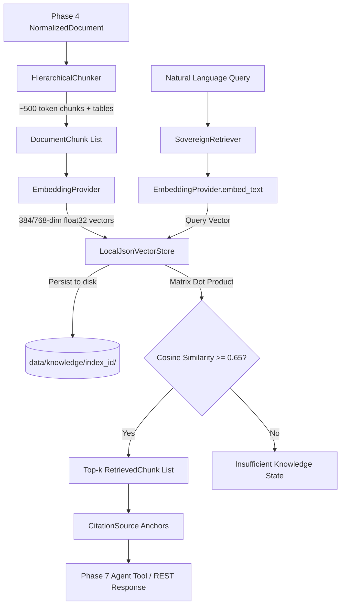

# Phase 6 — Sovereign Knowledge & RAG Subsystem Architecture

> **Component:** Sovereign Knowledge & RAG Layer  
> **Subsystem Path:** `backend/app/services/rag/`  
> **Authoritative Baseline:** `docs/implementation_plan.md`  

---

## 1. Overview & Architectural Goals

The Sovereign Knowledge & RAG Layer grounds agent reasoning in verified organizational engineering standards, operating procedures, and inspection guidelines (e.g. API 570, ASME B31.3, and MRPL SOPs). It enables high-precision semantic retrieval with traceable citations and table boundary preservation without relying on cloud vector databases or remote embedding APIs.

### Core Design Tenets:
1. **Zero External Sockets:** Operates strictly on-premise. No calls to OpenAI, Hugging Face, Anthropic, Pinecone, or Weaviate Cloud.
2. **Structure-Preserving Hierarchical Chunking:**
   - Respects section headings (H1/H2/H3), paragraphs, and page bounds.
   - Enforces a ~500-token target with ~50-token sliding overlap.
   - Preserves tabular structures as atomic markdown units, never cutting individual rows across chunks.
3. **Pluggable Local Embedding Abstraction:**
   - Abstract `EmbeddingProvider` interface decoupling retrieval logic from specific model weights.
   - Zero automatic downloads over the internet.
   - Deterministic semantic term-clustered mock provider for offline testing and CI.
4. **Persistent Local Vector Storage:**
   - Stores unit-normalized float32 vectors (`index.npy`) and rich JSON chunk metadata (`metadata.json`) under `data/knowledge/{index_id}/`.
   - Uses NumPy for dot-product cosine similarity calculation.
5. **Threshold Guardrails & Anti-Hallucination:**
   - Enforces a configurable similarity threshold (default 0.65).
   - If no candidates exceed the threshold, returns an explicit `insufficient_knowledge` state rather than returning nearest irrelevant vectors.
6. **Traceable Citations:**
   - Every retrieved chunk carries complete citation metadata: `source_document`, `page_number`, `chunk_id`, `content_sha256`, and `similarity_score`.

---

## 2. Component Structure

```
backend/app/services/rag/
├── __init__.py               # Public exports
├── base.py                   # Data models (DocumentChunk, RetrievedChunk, CitationSource) & Interfaces
├── chunker.py                # HierarchicalChunker with table boundary preservation
├── embeddings.py             # MockEmbeddingProvider, LocalSentenceTransformerEmbeddingProvider
├── vector_store.py           # LocalJsonVectorStore (NumPy + JSON persistence)
└── retriever.py              # SovereignRetriever orchestrator
```

---

## 3. Data Flow & Provenance Architecture



---

## 4. Citation & Provenance Contract

Every chunk retrieved by `SovereignRetriever` contains verifiable provenance:

```python
class CitationSource(BaseModel):
    source_document: str      # e.g. "SOP-MRPL-PIP-001.pdf"
    page_number: Optional[int] # e.g. 3
    chunk_id: str             # e.g. "a1b2c3d4e5f6_p3_c0002"
    content_sha256: str       # Cryptographic hash of the chunk text
    similarity_score: float   # e.g. 0.82
```

The downstream agent prompt (Phase 7) uses this structured citation anchor to generate exact bracketed references (e.g., `[Doc: SOP-MRPL-PIP-001.pdf, Page 3]`).

---

## 5. REST API Endpoints

1. **`POST /api/v1/rag/index`**:
   - Consumes an already ingested document by `document_sha256`.
   - Chunks document, computes dense embeddings, appends to `data/knowledge/`.
   - Returns: `RAGIndexResponse` with chunk count and index ID.

2. **`POST /api/v1/rag/query`**:
   - Accepts natural language query, `top_k`, and `similarity_threshold`.
   - Returns: `RAGQueryResponse` with structured results and citations or `insufficient_knowledge`.

3. **`GET /api/v1/rag/status`**:
   - Returns vector store backend, chunk count, indexed document count, embedding dimension, and storage path.

---

## 6. Portability & Air-Gap Compliance

- Filesystem paths are resolved portably using `pathlib.Path` anchored to `get_settings().knowledge_dir`.
- Zero hardcoded drive letters (`C:\`, `D:\`) or Windows-specific APIs.
- Unit tests verify zero outbound TCP sockets during execution.
