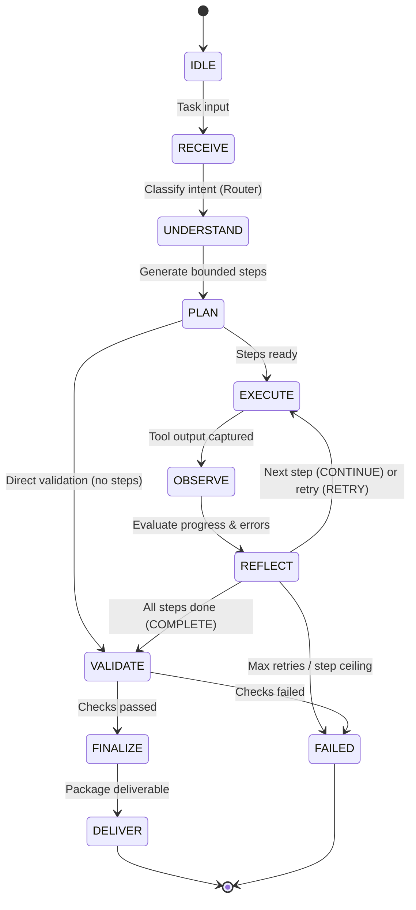

# Phase 7 — Agent State Machine & Orchestration Architecture

**Project:** SIH26117 — Sovereign On-Premise Agentic AI Workbench for MRPL  
**Subsystem:** Agent Reasoning & Orchestration Layer  
**Authoritative Source:** `docs/implementation_plan.md`  

---

## 1. Architectural Overview

Phase 7 introduces the autonomous reasoning engine for the Sovereign Workbench. Rather than treating agent operations as opaque black-box loops, the system enforces an **explicit 11-state deterministic state machine** with auditable transitions, strict safety bounds, loop detection, and full intermediate trace logging.

---

## 2. The 11-State Lifecycle Contract

| State | Purpose | Transition Triggers / Actions |
|-------|---------|-------------------------------|
| `IDLE` | Initial inactive state. | Triggered on agent context allocation. |
| `RECEIVE` | Ingests and sanitizes user task prompt. | Sanitizes text, generates unique `task_id`, initializes timestamp. |
| `UNDERSTAND` | Invokes Phase 3 Task Router. | Determines `task_type`, `capability`, `model_role`, priority. **Zero model IDs.** |
| `PLAN` | Decomposes task into an executable plan. | Produces `Plan` with $\le 8$ `PlanStep`s. Exceeding limit raises `PlanningError`. |
| `EXECUTE` | Dispatches step to tool registry. | Executes tool asynchronously with per-step timeout (45s). |
| `OBSERVE` | Records tool execution result. | Packages outputs/errors into immutable `StepObservation`. |
| `REFLECT` | Evaluates observation against plan. | Emits `StepReflection` (`CONTINUE`, `RETRY`, `FAIL`, `COMPLETE`). Limits retries to 2. |
| `VALIDATE` | Pre-delivery verification. | Deterministically checks plan completion, observations, grounding citations, and zero unresolved errors. |
| `FINALIZE` | Synthesizes deliverable package. | Formats final response with cited evidence and calculation summaries. |
| `DELIVER` | Final successful terminal state. | Emits completed `AgentRunResponse`. |
| `FAILED` | Terminal error state. | Captured on validation failure, unrecoverable tool errors, or timeout. |

---

## 3. Boundary & Invariant Enforcements

### 3.1 Router Boundary
The Agent Orchestrator calls the Phase 3 `RuleRouter` during the `UNDERSTAND` state:
- Input: `task: str`, `request_id: Optional[str]`.
- Output: `RoutingDecision` (`task_type`, `capability`, `model_role`, `confidence`, `reason`).
- **Invariant:** The agent orchestrator never selects or mentions physical model filenames/tags (`qwen2.5-coder:7b`, `deepseek-r1:7b`). It relies strictly on the `model_role` abstraction.

### 3.2 Knowledge & RAG Boundary
The Agent invokes the `RAGRetrievalTool` during the `EXECUTE` state:
- The tool interacts with the Phase 6 `SovereignRetriever`.
- Retrieved chunks are attached directly to `context.retrieved_context`.
- Grounded citations are verified during `VALIDATE` and packaged into the final deliverable during `FINALIZE`.
- **Invariant:** The agent never directly reads `.npy` vector files or manipulates FAISS/NumPy indices.

### 3.3 Safety Ceilings & Loop Protection
- `agent_max_steps`: Strict limit of 8 steps per workflow. Plans with $>8$ steps are rejected during planning; reflective loops are terminated if step count reaches 8.
- `agent_max_retries`: Strict limit of 2 retries per step.
- `agent_step_timeout_seconds`: 45.0s per tool invocation via `asyncio.wait_for`.
- `agent_global_timeout_seconds`: 180.0s global budget across the complete lifecycle.

### 3.4 Air-Gap Guarantee
All state transitions, planning algorithms, tool dispatches, and validation checks run entirely in-process and locally. Outbound network sockets and cloud AI APIs are strictly forbidden.
