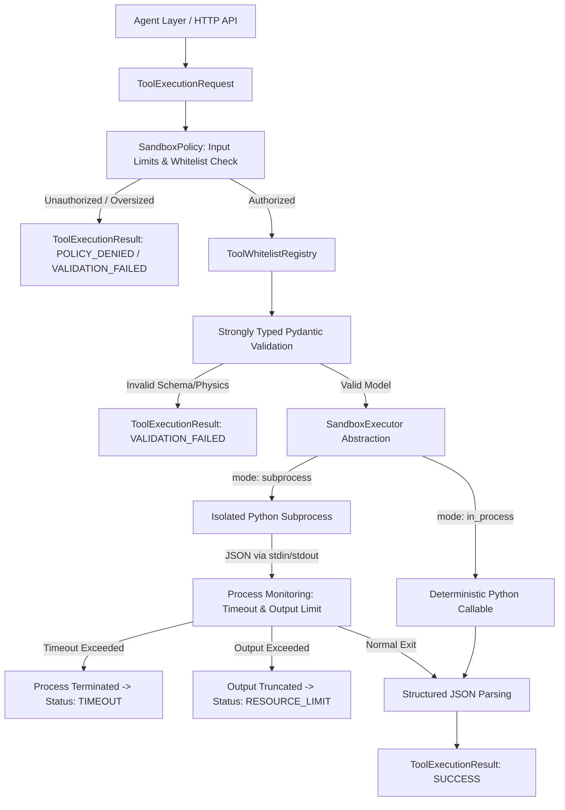

# Phase 8 — Sandboxed Tool Execution Architecture

## 1. Executive Overview

The Sandboxed Tool Execution Layer provides deterministic, secure, and isolated execution of industrial engineering calculation tools within the **SIH26117 Sovereign On-Premise Agentic AI Workbench**.

The agent must **NEVER** receive unrestricted operating-system execution. The primary security boundary is:
1. An explicit tool whitelist
2. Strongly typed Pydantic input models
3. Controlled execution backends (Subprocess with non-shell execution or direct In-Process)
4. Scratch-directory filesystem confinement with path-traversal prevention
5. Environment variable scrubbing (stripping API keys, secrets, credentials, tokens)
6. Strict execution timeouts and input/output payload size ceilings

> [!IMPORTANT]
> **Mandatory Security Notice:**
> Development subprocess isolation is not equivalent to a hardened production sandbox.
> Application-level network restrictions are not equivalent to physical air-gap isolation.

---

## 2. Architecture & Execution Flow

### Execution Boundary Principles:
- The Agent layer depends **strictly** on the abstract `SandboxExecutor` interface, never calling `subprocess.run`, `subprocess.Popen`, or `os.system` directly.
- The default development executor (`SubprocessSandboxExecutor`) spawns a dedicated worker (`python -m app.services.sandbox.runner`) with `shell=False`, a sanitized minimal environment, and `cwd` restricted to `data/sandbox/scratch`.
- The architecture allows seamless replacement in production environments with `LinuxContainerExecutor` or `GVisorExecutor` without altering agent logic.

---

## 3. Tool Whitelist & Engineering Calculations

The initial Phase 8 tool registry strictly whitelists two deterministic calculation tools. Any request specifying tools outside this registry (such as `shell`, `cmd`, `powershell`, `bash`, `python`, `system`, or `arbitrary_command`) is immediately rejected with `ExecutionStatus.POLICY_DENIED`.

### 3.1 Minimum Wall Thickness Check (`minimum_wall_thickness_check`)
- **Input Model**: `MinimumWallThicknessInput`
  - `measured_thickness_mm`: float $> 0.0$
  - `minimum_required_mm`: float $> 0.0$
- **Output Model**: `MinimumWallThicknessOutput`
  - `measured_thickness_mm`: float
  - `minimum_required_mm`: float
  - `margin_mm`: $t_{measured} - t_{required}$ (rounded to 4 decimals)
  - `status`: `"PASS"` if $t_{measured} \ge t_{required}$ else `"FAIL"`
- **Physical Invariants**: Strictly rejects negative thickness, zero thickness, or non-numeric inputs.

### 3.2 Corrosion Rate & Remaining Life Calculation (`corrosion_rate_calc`)
- **Engineering Formula**:
  $$\text{corrosion\_rate} = \frac{t_{previous} - t_{current}}{\Delta t} \quad (\text{mm/year})$$
  $$\text{remaining\_life} = \frac{t_{current} - t_{minimum}}{\text{corrosion\_rate}} \quad (\text{years})$$
- **Nomenclature Notice**: Documented strictly as *"deterministic corrosion-rate / remaining-life calculation using the configured engineering formula"*; no unwarranted compliance claims (such as API 570) are asserted without full standard verification.
- **Input Model**: `CorrosionRateInput`
  - `previous_thickness_mm`: float $> 0.0$
  - `current_thickness_mm`: float $> 0.0$
  - `elapsed_time_years`: float $> 0.0$
  - `minimum_required_mm`: optional float $> 0.0$
- **Output Model**: `CorrosionRateOutput`
  - `corrosion_rate_mm_per_year`: float
  - `remaining_life_years`: optional float
  - `remaining_life_status`:
    - `"CALCULATED"`: Valid remaining life calculated.
    - `"STABLE"`: Zero or negative corrosion rate ($t_{current} \ge t_{previous}$).
    - `"EXCEEDED_MINIMUM"`: $t_{current} < t_{minimum}$ with active corrosion.
    - `"NOT_APPLICABLE"`: No minimum thickness supplied.

---

## 4. Security Controls & Guardrails

| Control Area | Implementation Mechanism | Defensive Behavior |
| :--- | :--- | :--- |
| **Tool Whitelist** | `ToolWhitelistRegistry` matching exact canonical tool names | Fails closed on unknown tool names (`POLICY_DENIED`). |
| **Code Execution** | No generic `execute_python(code)`, `eval()`, or `exec()` for untrusted inputs | Arbitrary code execution is architecturally prohibited. |
| **Subprocess Execution** | Direct binary invocation (`sys.executable`), `shell=False`, argument list passing | Eliminates shell metacharacter and command injection risks. |
| **Filesystem Confinement** | `Path.resolve()` relative to `data/sandbox/scratch` | Blocks `../`, `..\`, absolute paths, drive-letter paths, and UNC roots. |
| **Environment Isolation** | Strict environment scrubbing in `SandboxPolicy.build_clean_environment` | Removes all keys containing `KEY`, `SECRET`, `AUTH`, `PASS`, `PASSWORD`, `TOKEN`, `CREDENTIAL`. Retains minimal system variables (`SYSTEMROOT`, `PATH`, and sets backend root `PYTHONPATH`). |
| **Execution Timeout** | Default 15.0s (configurable down to 1.0s in tests) | Kills process tree on expiration; returns `ExecutionStatus.TIMEOUT`. |
| **Payload Limits** | Max input: 64 KB; Max output: 64 KB | Oversized input triggers `VALIDATION_FAILED`; oversized output is truncated with `ExecutionStatus.RESOURCE_LIMIT`. |
| **Network Security** | Zero network dependencies or socket libraries imported into sandbox tools | No outbound socket connections permitted. |
| **AST Screening** | `PythonASTPreScreener` as defense-in-depth | Rejects dangerous AST imports (`os`, `subprocess`, `socket`, `urllib`, `requests`) and calls (`eval`, `exec`, `compile`). |

---

## 5. Agent Integration (`SandboxedCalculationTool`)

In Phase 7, the Agent orchestrated tools using the `AgentTool` contract and a frozen `MockCalculationTool`.
In Phase 8, `SandboxedCalculationTool` is introduced additively:
- Implements `AgentTool` (`name="sandboxed_calculation_tool"`).
- Proxies requests to an injected `SandboxExecutor` (defaulting to `SubprocessSandboxExecutor`).
- Leaves `MockCalculationTool` completely intact for backward compatibility.
- Disallows direct access from agent nodes to OS processes.

---

## 6. Development vs. Production Hardening

| Feature | Windows Development (Current) | Linux Production (Target) |
| :--- | :--- | :--- |
| **Process Isolation** | Isolated subprocess with non-shell execution and working directory restriction. | Rootless OCI containers (Podman/Docker) or gVisor sandbox. |
| **Memory Limits** | Contractual limit check; OS-level memory cgroups not enforced on Windows subprocesses. | Linux cgroups v2 (`memory.max = 512M`) with kernel OOM killer. |
| **Network Isolation** | Application-level hygiene (no network libraries invoked). | Network namespace isolation (`--network none`). |
| **Filesystem Isolation** | Path resolution checks against scratch directory. | Read-only container rootfs with ephemeral tmpfs scratch mount. |

---

## 7. Configuration Reference

Additive configuration keys added to `app.core.config.Settings`:
- `sandbox_enabled`: bool (default: `True`)
- `sandbox_timeout_seconds`: float (default: `15.0`)
- `sandbox_memory_limit_mb`: int (default: `512`)
- `sandbox_max_output_bytes`: int (default: `65536` / 64 KB)
- `sandbox_max_input_bytes`: int (default: `65536` / 64 KB)
- `sandbox_scratch_dir`: str (default: `"data/sandbox/scratch"`)
